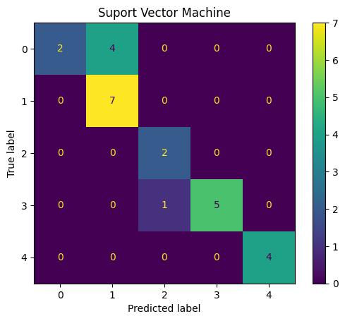
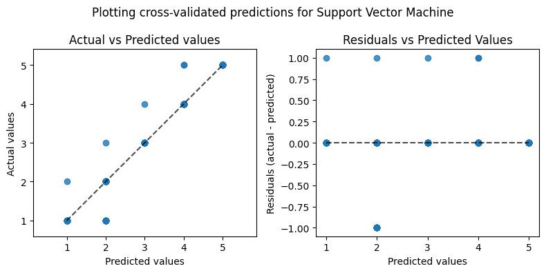
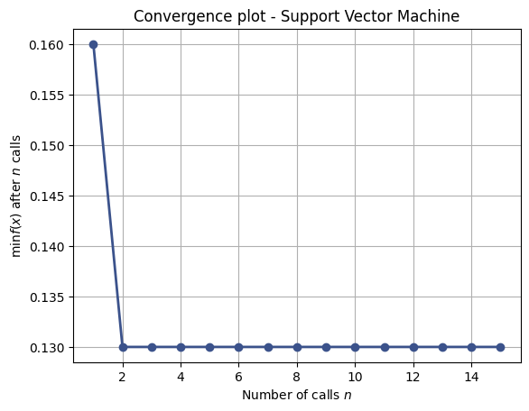
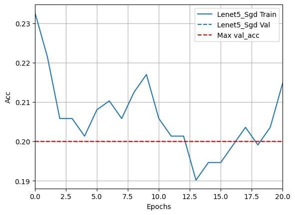
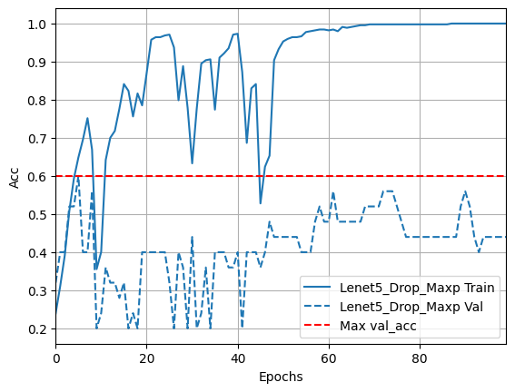
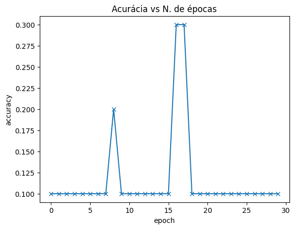

# Visão computacional aplicada a classificacão da qualidade do Algodão

## Descrição
Em busca de aperfeiçoar e testar os modelos anteriormente relatados nos trabalho, busca-se agora aplica-los em um banco de dados que possui imagens de 5 classes distintas de linter de algodão com impurezas. Buscas-se também identificar melhores hardwares disponíveis para a metodologia de coleta de dados necessárias para construção do modelo de classificação.

## Metodologias:
Testar os modelos anteriormente utilizados na revisão bibliográfica utilizando o banco de dados de imagens com classes de algodão no link [IEEE Dataport - Cotton linter class](https://ieee-dataport.org/open-access/different-linter-classes) e buscar validar e avaliar a capacidade de generalização do modelo;

## Links relacionados
- [Miro App](https://miro.com/app/board/uXjVM2i963I=/)

- [Notion](https://gabby-subway-eb1.notion.site/Modelos-de-classifica-o-para-Classifica-o-do-Algod-o-d757bef1fd3448bc92a8a7dc0a08e7b6?pvs=4)

## Galeria

</img>
</img>
</img>
</img>
</img>
</img>


## Diretório
    /image_agumentation
        data_augmentation.py
    /model_otimization
        build_hypermodel.py
        model_tuner.py
    /models-srr
        EDSR_x2.pb
        EDSR_x3.pb
        EDSR_x4.pb
    /tlinter
        /classe1
            1.jpg ...
        /classe2
            26.jpg ...
        /classe3 ...
        /classe4 ...
        /classe5 ...
    /tlinter_otsu
        /classe1
            1.jpg ...
        /classe2
            26.jpg ...
        /classe3 ...
        /classe4 ...
        /classe5 ...
    /to_torch
        /augh
            ... .jpg ...
        /test
            ... .jpg ...
        /train
            ... .jpg ...
        /valid
            ... .jpg ...
    cotton_class.ipynb
    tensor.ipynb
    teste.ipynb

## Classes
### image_augmentation
```python
image_augmentation.data_augmentation.py

    class ImageDataAugmentation:
        (
            classes,
            path,
            num_batches
        )
            def image_augmentation()

```
### model_otimization.build_hypermodel
```python
model_otimization.build_hypermodel.py

    class BuildHypermodel:
        ()
```
### model_otimization.model_tuner
```python

  
    class ModelTuner:
        (
            image_size,
            path
        )

        def get_log_dir():
        
        def tuner_bayesian_optimization(

            model = build_model(),
            objective = "val_accuracy",
            training_Data = train_data,
            valid_Data = valid_data,
            max_trials = 0,
            epochs = 0
        ):

```